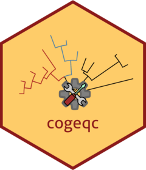

<!-- README.md is generated from README.Rmd. Please edit that file -->

# cogeqc 

<!-- badges: start -->

[](https://lifecycle.r-lib.org/articles/stages.html#experimental)
[](https://github.com/almeidasilvaf/cogeqc/actions)
<!-- badges: end -->

The goal of `cogeqc` is to facilitate systematic quality checks on
standard comparative genomics analyses to help researchers detect issues
and select the most suitable parameters for each data set.

## Installation instructions

Get the latest stable `R` release from
[CRAN](http://cran.r-project.org/). Then install `cogeqc` using from
[Bioconductor](http://bioconductor.org/) the following code:

``` r
if (!requireNamespace("BiocManager", quietly = TRUE)) {
    install.packages("BiocManager")
}

BiocManager::install("cogeqc")
```

And the development version from
[GitHub](https://github.com/almeidasilvaf/cogeqc) with:

``` r
BiocManager::install("almeidasilvaf/cogeqc")
```

## Citation

Below is the citation output from using `citation('cogeqc')` in R.
Please run this yourself to check for any updates on how to cite
**cogeqc**.

``` r
print(citation('cogeqc'), bibtex = TRUE)
#> Warning in citation("cogeqc"): no date field in DESCRIPTION file of package
#> 'cogeqc'
#> Warning in citation("cogeqc"): could not determine year for 'cogeqc' from
#> package DESCRIPTION file
#> 
#> To cite package 'cogeqc' in publications use:
#> 
#>   Fabrício Almeida-Silva (NA). cogeqc: Systematic quality checks on
#>   comparative genomics analyses. R package version 0.99.0.
#>   https://github.com/almeidasilvaf/cageminer
#> 
#> A BibTeX entry for LaTeX users is
#> 
#>   @Manual{,
#>     title = {cogeqc: Systematic quality checks on comparative genomics analyses},
#>     author = {Fabrício Almeida-Silva},
#>     note = {R package version 0.99.0},
#>     url = {https://github.com/almeidasilvaf/cageminer},
#>   }
```

Please note that the `cogeqc` was only made possible thanks to many
other R and bioinformatics software authors, which are cited either in
the vignettes and/or the paper(s) describing this package.

## Code of Conduct

Please note that the `cogeqc` project is released with a [Contributor
Code of Conduct](http://bioconductor.org/about/code-of-conduct/). By
contributing to this project, you agree to abide by its terms.

## Development tools

-   Continuous code testing is possible thanks to [GitHub
    actions](https://www.tidyverse.org/blog/2020/04/usethis-1-6-0/)
    through *[usethis](https://CRAN.R-project.org/package=usethis)*,
    *[remotes](https://CRAN.R-project.org/package=remotes)*, and
    *[rcmdcheck](https://CRAN.R-project.org/package=rcmdcheck)*
    customized to use [Bioconductor’s docker
    containers](https://www.bioconductor.org/help/docker/) and
    *[BiocCheck](https://bioconductor.org/packages/3.13/BiocCheck)*.
-   Code coverage assessment is possible thanks to
    [codecov](https://codecov.io/gh) and
    *[covr](https://CRAN.R-project.org/package=covr)*.
-   The [documentation website](http://almeidasilvaf.github.io/cogeqc)
    is automatically updated thanks to
    *[pkgdown](https://CRAN.R-project.org/package=pkgdown)*.
-   The documentation is formatted thanks to
    *[devtools](https://CRAN.R-project.org/package=devtools)* and
    *[roxygen2](https://CRAN.R-project.org/package=roxygen2)*.

For more details, check the `dev` directory.

This package was developed using
*[biocthis](https://bioconductor.org/packages/3.13/biocthis)*.
