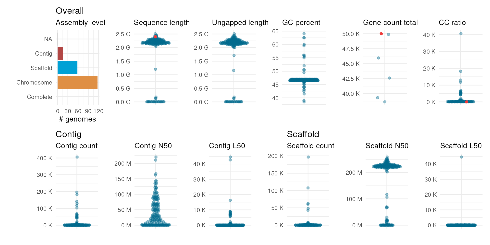
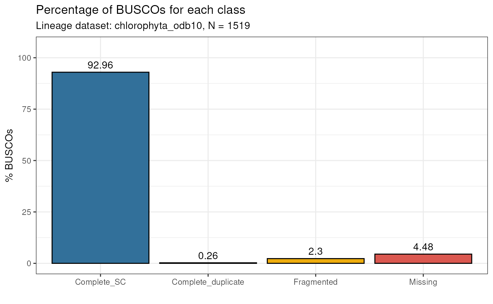
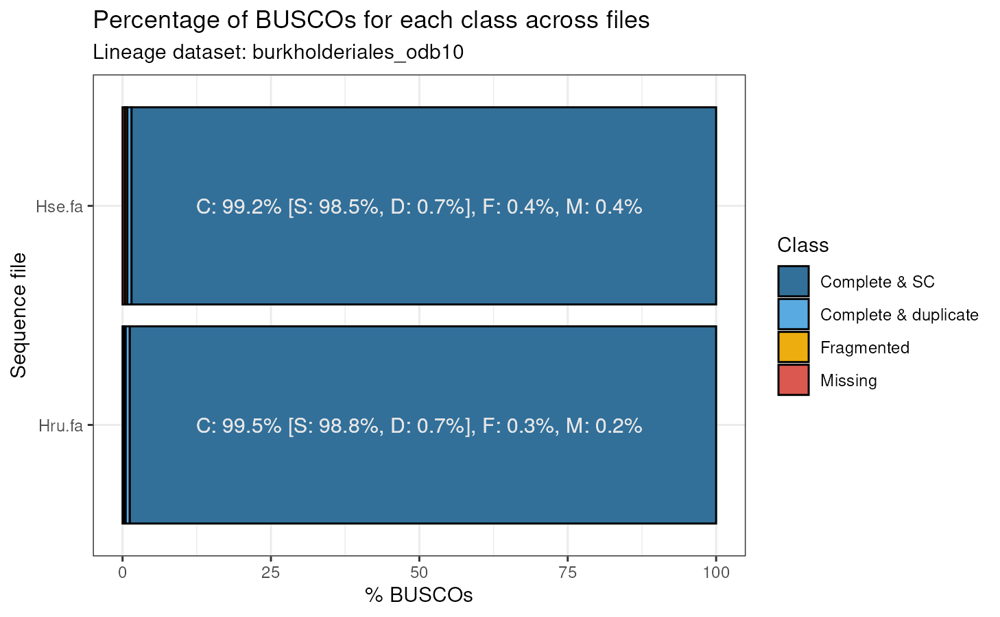

# Assessing genome assembly and annotation quality

## Introduction

When working on your own genome project or when using publicly available
genomes for comparative analyses, it is critical to assess the quality
of your data. Over the past years, several tools have been developed and
several metrics have been proposed to assess the quality of a genome
assembly and annotation. `cogeqc` helps users interpret their genome
assembly statistics by comparing them with statistics on publicly
available genomes on the NCBI. Additionally, `cogeqc` also provides an
interface to BUSCO (Simão et al. 2015), a popular tool to assess gene
space completeness. Graphical functions are available to make
publication-ready plots that summarize the results of quality control.

## Installation

You can install `cogeqc` from Bioconductor with the following code:

``` r

if(!requireNamespace('BiocManager', quietly = TRUE))
  install.packages('BiocManager')
BiocManager::install("cogeqc")
```

``` r

# Load package after installation
library(cogeqc)
```

## Assessing genome assembly quality: statistics in a context

When analyzing and interpreting genome assembly statistics, it is often
useful to place your stats in a context by comparing them with stats
from genomes of closely-related or even the same species. `cogeqc`
provides users with an interface to the NCBI Datasets API, which can be
used to retrieve summary stats for genomes on NCBI. In this section, we
will guide you on how to retrieve such information and use it as a
reference to interpret your data.

### Obtaining assembly statistics for NCBI genomes

To obtain a data frame of summary statistics for NCBI genomes of a
particular taxon, you will use the function
[`get_genome_stats()`](../reference/get_genome_stats.md). In the *taxon*
parameter, you must specify the taxon from which data will be extracted.
This can be done either by passing a character scalar with taxon name or
by passing a numeric scalar with NCBI Taxonomy ID. For example, the code
below demonstrates two ways of extracting stats on maize (*Zea mays*)
genomes on NCBI:

``` r

# Example 1: get stats for all maize genomes using taxon name
maize_stats <- get_genome_stats(taxon = "Zea mays")
head(maize_stats)
#>         accession  source species_taxid species_name species_common_name
#> 1 GCA_902167145.1 GENBANK          4577     Zea mays                <NA>
#> 2 GCF_902167145.1  REFSEQ          4577     Zea mays                <NA>
#> 3 GCA_022117705.1 GENBANK          4577     Zea mays                <NA>
#> 4 GCA_051912235.1 GENBANK          4577     Zea mays                <NA>
#> 5 GCA_029775835.1 GENBANK          4577     Zea mays                <NA>
#> 6 GCA_965287125.1 GENBANK          4577     Zea mays                <NA>
#>   species_ecotype species_strain species_isolate species_cultivar
#> 1            <NA>             NA            <NA>              B73
#> 2            <NA>             NA            <NA>              B73
#> 3            <NA>             NA            <NA>        Mo17-2021
#> 4            <NA>             NA            <NA>            LH244
#> 5            <NA>             NA            <NA>           LT2357
#> 6            <NA>             NA            <NA>             <NA>
#>   assembly_level assembly_status                      assembly_name
#> 1     Chromosome         current           Zm-B73-REFERENCE-NAM-5.0
#> 2     Chromosome         current           Zm-B73-REFERENCE-NAM-5.0
#> 3           <NA>         current Zm-Mo17-REFERENCE-CAU-T2T-assembly
#> 4     Chromosome         current                       ASM5191223v1
#> 5     Chromosome         current                       ASM2977583v1
#> 6     Chromosome         current                  Zm-EA1197-AMZ-1.0
#>   assembly_type submission_date
#> 1       haploid              NA
#> 2       haploid              NA
#> 3       haploid              NA
#> 4       haploid              NA
#> 5       haploid              NA
#> 6       haploid              NA
#>                                                                              submitter
#> 1                                                                             MaizeGDB
#> 2                                                                             MaizeGDB
#> 3                                                         China Agriculture University
#> 4                                                         China Agriculture University
#> 5                                                       Beijing Lantron Seed Co., LTD.
#> 6 Institut national de recherche pour l'agriculture, l'alimentation et l'environnement
#>                       sequencing_technology atypical  refseq_category
#> 1                             PacBio SEQUEL    FALSE reference genome
#> 2                             PacBio SEQUEL    FALSE reference genome
#> 3        Oxford Nanopore PromethION; PacBio    FALSE             <NA>
#> 4 Oxford Nanopore PromethION; PacBio Sequel    FALSE             <NA>
#> 5                             PacBio Sequel    FALSE             <NA>
#> 6                       Illumina HiSeq 2500    FALSE             <NA>
#>   chromosome_count sequence_length ungapped_length contig_count contig_N50
#> 1               10      2182075994      2178268108         1393   47037903
#> 2               10      2182075994      2178268108         1393   47037903
#> 3               10      2178604320      2178604320           10  220303002
#> 4               10      2286149880      2286149380           15  210418674
#> 5               10      2106865080      2106637080          460   15883073
#> 6               10      2226752758      2214060529        41618     119671
#>   contig_L50 scaffold_count scaffold_N50 scaffold_L50 GC_percent
#> 1         16            685    226353449            5       47.0
#> 2         16            685    226353449            5       47.0
#> 3          5             10    220303002            5       47.0
#> 4          5             10    228666739            5       46.5
#> 5         41             10    222005600            5       47.0
#> 6       5706             10    239478437            5       46.5
#>   annotation_provider annotation_release_date gene_count_total
#> 1                <NA>                    <NA>               NA
#> 2         NCBI RefSeq              2025-02-14            49888
#> 3                <NA>                    <NA>               NA
#> 4                <NA>                    <NA>               NA
#> 5                <NA>                    <NA>               NA
#> 6                <NA>                    <NA>               NA
#>   gene_count_coding gene_count_noncoding gene_count_pseudogene gene_count_other
#> 1                NA                   NA                    NA               NA
#> 2             34313                10353                  5222               NA
#> 3                NA                   NA                    NA               NA
#> 4                NA                   NA                    NA               NA
#> 5                NA                   NA                    NA               NA
#> 6                NA                   NA                    NA               NA
#>   CC_ratio
#> 1    139.3
#> 2    139.3
#> 3      1.0
#> 4      1.5
#> 5     46.0
#> 6   4161.8
str(maize_stats)
#> 'data.frame':    191 obs. of  36 variables:
#>  $ accession              : chr  "GCA_902167145.1" "GCF_902167145.1" "GCA_022117705.1" "GCA_051912235.1" ...
#>  $ source                 : chr  "GENBANK" "REFSEQ" "GENBANK" "GENBANK" ...
#>  $ species_taxid          : int  4577 4577 4577 4577 4577 4577 4577 4577 4577 4577 ...
#>  $ species_name           : chr  "Zea mays" "Zea mays" "Zea mays" "Zea mays" ...
#>  $ species_common_name    : chr  NA NA NA NA ...
#>  $ species_ecotype        : chr  NA NA NA NA ...
#>  $ species_strain         : logi  NA NA NA NA NA NA ...
#>  $ species_isolate        : chr  NA NA NA NA ...
#>  $ species_cultivar       : chr  "B73" "B73" "Mo17-2021" "LH244" ...
#>  $ assembly_level         : Factor w/ 4 levels "Complete","Chromosome",..: 2 2 NA 2 2 2 2 2 2 2 ...
#>  $ assembly_status        : chr  "current" "current" "current" "current" ...
#>  $ assembly_name          : chr  "Zm-B73-REFERENCE-NAM-5.0" "Zm-B73-REFERENCE-NAM-5.0" "Zm-Mo17-REFERENCE-CAU-T2T-assembly" "ASM5191223v1" ...
#>  $ assembly_type          : chr  "haploid" "haploid" "haploid" "haploid" ...
#>  $ submission_date        : logi  NA NA NA NA NA NA ...
#>  $ submitter              : chr  "MaizeGDB" "MaizeGDB" "China Agriculture University" "China Agriculture University" ...
#>  $ sequencing_technology  : chr  "PacBio SEQUEL" "PacBio SEQUEL" "Oxford Nanopore PromethION; PacBio" "Oxford Nanopore PromethION; PacBio Sequel" ...
#>  $ atypical               : logi  FALSE FALSE FALSE FALSE FALSE FALSE ...
#>  $ refseq_category        : chr  "reference genome" "reference genome" NA NA ...
#>  $ chromosome_count       : int  10 10 10 10 10 10 10 10 10 10 ...
#>  $ sequence_length        : num  2.18e+09 2.18e+09 2.18e+09 2.29e+09 2.11e+09 ...
#>  $ ungapped_length        : num  2.18e+09 2.18e+09 2.18e+09 2.29e+09 2.11e+09 ...
#>  $ contig_count           : int  1393 1393 10 15 460 41618 43866 50241 49556 47620 ...
#>  $ contig_N50             : int  47037903 47037903 220303002 210418674 15883073 119671 106563 95612 93708 92391 ...
#>  $ contig_L50             : int  16 16 5 5 41 5706 6261 7033 7057 6712 ...
#>  $ scaffold_count         : int  685 685 10 10 10 10 10 10 10 10 ...
#>  $ scaffold_N50           : int  226353449 226353449 220303002 228666739 222005600 239478437 231459016 234294940 230804033 218589869 ...
#>  $ scaffold_L50           : int  5 5 5 5 5 5 5 5 5 5 ...
#>  $ GC_percent             : num  47 47 47 46.5 47 46.5 47 47 47 47 ...
#>  $ annotation_provider    : chr  NA "NCBI RefSeq" NA NA ...
#>  $ annotation_release_date: chr  NA "2025-02-14" NA NA ...
#>  $ gene_count_total       : int  NA 49888 NA NA NA NA NA NA NA NA ...
#>  $ gene_count_coding      : int  NA 34313 NA NA NA NA NA NA NA NA ...
#>  $ gene_count_noncoding   : int  NA 10353 NA NA NA NA NA NA NA NA ...
#>  $ gene_count_pseudogene  : int  NA 5222 NA NA NA NA NA NA NA NA ...
#>  $ gene_count_other       : int  NA NA NA NA NA NA NA NA NA NA ...
#>  $ CC_ratio               : num  139.3 139.3 1 1.5 46 ...

# Example 2: get stats for all maize genomes using NCBI Taxonomy ID
maize_stats2 <- get_genome_stats(taxon = 4577)

# Checking if objects are the same
identical(maize_stats, maize_stats2)
#> [1] TRUE
```

As you can see, there are 191 maize genomes on the NCBI. You can also
include filters in your searches by passing a list of key-value pairs
with keys in list names and values in elements. For instance, to obtain
only **chromosome-scale** and **annotated** maize genomes, you would
run:

``` r

# Get chromosome-scale maize genomes with annotation
## Create list of filters
filt <- list(
    filters.has_annotation = "true",
    filters.assembly_level = "chromosome"
)
filt
#> $filters.has_annotation
#> [1] "true"
#> 
#> $filters.assembly_level
#> [1] "chromosome"

## Obtain data
filtered_maize_genomes <- get_genome_stats(taxon = "Zea mays", filters = filt)
dim(filtered_maize_genomes)
#> [1]  5 36
```

For a full list of filtering parameters and possible arguments, see the
[API
documentation](https://www.ncbi.nlm.nih.gov/datasets/docs/v2/reference-docs/rest-api/#get-/genome/taxon/-taxons-/dataset_report).

### Comparing custom stats with NCBI stats

Now, suppose you sequenced a genome, obtained assembly and annotation
stats, and want to compare them to NCBI genomes to identify potential
issues. Examples of situations you may encounter include:

- The genome you assembled is huge and you think there might be a
  problem with your assembly.

- Your gene annotation pipeline predicted *n* genes, but you are not
  sure if this number is reasonable compared to other assemblies of the
  same species or closely-related species.

To compare user-defined summary stats with NCBI stats, you will use the
function
[`compare_genome_stats()`](../reference/compare_genome_stats.md). This
function will include the values you observed for each statistic into a
distribution (based on NCBI stats) and return the percentile and rank of
your observed values in each distribution.

As an example, let’s go back to our maize stats we obtained in the
previous section. Suppose you sequenced a new maize genome and observed
the following values:

1.  Genome size = 2.4 Gb
2.  Number of genes = 50,000
3.  CC ratio = 2 [^1]

To compare your observed values with those for publicly available maize
genomes, you need to store them in a data frame. The column
**accession** is mandatory, and any other column will be matched against
columns in the data frame obtained with
[`get_genome_stats()`](../reference/get_genome_stats.md). Thus, make
sure column names in your data frame match column names in the reference
data frame. Then, you can compare both data frames as below:

``` r

# Check column names in the data frame of stats for maize genomes on the NCBI
names(maize_stats)
#>  [1] "accession"               "source"                 
#>  [3] "species_taxid"           "species_name"           
#>  [5] "species_common_name"     "species_ecotype"        
#>  [7] "species_strain"          "species_isolate"        
#>  [9] "species_cultivar"        "assembly_level"         
#> [11] "assembly_status"         "assembly_name"          
#> [13] "assembly_type"           "submission_date"        
#> [15] "submitter"               "sequencing_technology"  
#> [17] "atypical"                "refseq_category"        
#> [19] "chromosome_count"        "sequence_length"        
#> [21] "ungapped_length"         "contig_count"           
#> [23] "contig_N50"              "contig_L50"             
#> [25] "scaffold_count"          "scaffold_N50"           
#> [27] "scaffold_L50"            "GC_percent"             
#> [29] "annotation_provider"     "annotation_release_date"
#> [31] "gene_count_total"        "gene_count_coding"      
#> [33] "gene_count_noncoding"    "gene_count_pseudogene"  
#> [35] "gene_count_other"        "CC_ratio"

# Create a simulated data frame of stats for a maize genome
my_stats <- data.frame(
    accession = "my_lovely_maize",
    sequence_length = 2.4 * 1e9,
    gene_count_total = 50000,
    CC_ratio = 2
)

# Compare stats
compare_genome_stats(ncbi_stats = maize_stats, user_stats = my_stats)
#>         accession         variable percentile rank
#> 1 my_lovely_maize  sequence_length 0.96875000    7
#> 2 my_lovely_maize gene_count_total 1.00000000    1
#> 3 my_lovely_maize         CC_ratio 0.02521008    3
```

### Visualizing summary assembly statistics

To have a visual representation of the summary stats obtained with
[`get_genome_stats()`](../reference/get_genome_stats.md), you will use
the function [`plot_genome_stats()`](../reference/plot_genome_stats.md).

``` r

# Summarize genome stats in a plot
plot_genome_stats(ncbi_stats = maize_stats)
```


Finally, you can pass your data frame of observed stats to highlight
your values (as red points) in the distributions.

``` r

plot_genome_stats(ncbi_stats = maize_stats, user_stats = my_stats)
```



## Assessing gene space completeness with BUSCO

One of the most common metrics to assess gene space completeness is
BUSCO (best universal single-copy orthologs) (Simão et al. 2015).
`cogeqc` allows users to run BUSCO from an R session and visualize
results graphically. BUSCO summary statistics will help you assess which
assemblies have high quality based on the percentage of complete BUSCOs.

### Running BUSCO

To run BUSCO from R, you will use the function
[`run_busco()`](../reference/run_busco.md)[^2]. Here, we will use an
example FASTA file containing the first 1,000 lines of the
*Herbaspirilllum seropedicae SmR1* genome (GCA_000143225), which was
downloaded from Ensembl Bacteria. We will run BUSCO using
*burkholderiales_odb10* as the lineage dataset. To view all available
datasets, run
[`list_busco_datasets()`](../reference/list_busco_datasets.md).

``` r

# Path to FASTA file
sequence <- system.file("extdata", "Hse_subset.fa", package = "cogeqc")

# Path to directory where BUSCO datasets will be stored
download_path <- paste0(tempdir(), "/datasets")

# Run BUSCO if it is installed
if(busco_is_installed()) {
  run_busco(sequence, outlabel = "Hse", mode = "genome",
            lineage = "burkholderiales_odb10",
            outpath = tempdir(), download_path = download_path)
}
```

The output will be stored in the directory specified in *outpath*. You
can read and parse BUSCO’s output with the function
[`read_busco()`](../reference/read_busco.md). For example, let’s read
the output of a BUSCO run using the genome of the green algae
*Ostreococcus tauri*. The output directory is `/extdata`.

``` r

# Path to output directory
output_dir <- system.file("extdata", package = "cogeqc")

busco_summary <- read_busco(output_dir)
busco_summary
#>                Class Frequency           Lineage
#> 1        Complete_SC      1412 chlorophyta_odb10
#> 2 Complete_duplicate         4 chlorophyta_odb10
#> 3         Fragmented        35 chlorophyta_odb10
#> 4            Missing        68 chlorophyta_odb10
```

This is an example output for a BUSCO run with a single FASTA file. You
can also specify a directory containing multiple FASTA files in the
*sequence* argument of [`run_busco()`](../reference/run_busco.md). This
way, BUSCO will be run in batch mode. Let’s see what the output of BUSCO
in batch mode looks like:

``` r

data(batch_summary)
batch_summary
#>                Class Frequency               Lineage   File
#> 1        Complete_SC      98.5 burkholderiales_odb10 Hse.fa
#> 2        Complete_SC      98.8 burkholderiales_odb10 Hru.fa
#> 3 Complete_duplicate       0.7 burkholderiales_odb10 Hse.fa
#> 4 Complete_duplicate       0.7 burkholderiales_odb10 Hru.fa
#> 5         Fragmented       0.4 burkholderiales_odb10 Hse.fa
#> 6         Fragmented       0.3 burkholderiales_odb10 Hru.fa
#> 7            Missing       0.4 burkholderiales_odb10 Hse.fa
#> 8            Missing       0.2 burkholderiales_odb10 Hru.fa
```

The only difference between this data frame and the previous one is the
column **File**, which contains information on the FASTA file. The
example dataset `batch_summary` contains the output of
[`run_busco()`](../reference/run_busco.md) using a directory containing
two genomes (*Herbaspirillum seropedicae SmR1* and *Herbaspirillum
rubrisubalbicans M1*) as parameter to the *sequence* argument.

### Visualizing BUSCO summary statistics

After using [`run_busco()`](../reference/run_busco.md) and parsing its
output with [`read_busco()`](../reference/read_busco.md), users can
visualize summary statistics with
[`plot_busco()`](../reference/plot_busco.md).

``` r

# Single FASTA file - Ostreococcus tauri
plot_busco(busco_summary)
```



``` r


# Batch mode - Herbaspirillum seropedicae and H. rubrisubalbicans
plot_busco(batch_summary)
```



We usually consider genomes with \>90% of complete BUSCOs as having high
quality. Thus, we can conclude that the three genomes analyzed here are
high-quality genomes.

## Session information

This document was created under the following conditions:

``` r

sessioninfo::session_info()
#> ─ Session info ───────────────────────────────────────────────────────────────
#>  setting  value
#>  version  R Under development (unstable) (2026-03-01 r89508)
#>  os       Ubuntu 24.04.4 LTS
#>  system   x86_64, linux-gnu
#>  ui       X11
#>  language en
#>  collate  en_US.UTF-8
#>  ctype    en_US.UTF-8
#>  tz       UTC
#>  date     2026-03-05
#>  pandoc   3.9 @ /usr/bin/ (via rmarkdown)
#>  quarto   1.8.27 @ /usr/local/bin/quarto
#> 
#> ─ Packages ───────────────────────────────────────────────────────────────────
#>  package           * version date (UTC) lib source
#>  ape                 5.8-1   2024-12-16 [1] CRAN (R 4.6.0)
#>  aplot               0.2.9   2025-09-12 [1] CRAN (R 4.6.0)
#>  beeswarm            0.4.0   2021-06-01 [1] CRAN (R 4.6.0)
#>  BiocGenerics        0.57.0  2025-10-30 [1] Bioconductor 3.23 (R 4.6.0)
#>  BiocManager         1.30.27 2025-11-14 [1] CRAN (R 4.6.0)
#>  BiocStyle         * 2.39.0  2025-10-30 [1] Bioconductor 3.23 (R 4.6.0)
#>  Biostrings          2.79.4  2026-01-07 [1] Bioconductor 3.23 (R 4.6.0)
#>  bookdown            0.46    2025-12-05 [1] CRAN (R 4.6.0)
#>  bslib               0.10.0  2026-01-26 [2] CRAN (R 4.6.0)
#>  cachem              1.1.0   2024-05-16 [2] CRAN (R 4.6.0)
#>  cli                 3.6.5   2025-04-23 [2] CRAN (R 4.6.0)
#>  cogeqc            * 1.15.1  2026-03-05 [1] Bioconductor
#>  crayon              1.5.3   2024-06-20 [2] CRAN (R 4.6.0)
#>  desc                1.4.3   2023-12-10 [2] CRAN (R 4.6.0)
#>  digest              0.6.39  2025-11-19 [2] CRAN (R 4.6.0)
#>  dplyr               1.2.0   2026-02-03 [1] CRAN (R 4.6.0)
#>  evaluate            1.0.5   2025-08-27 [2] CRAN (R 4.6.0)
#>  farver              2.1.2   2024-05-13 [1] CRAN (R 4.6.0)
#>  fastmap             1.2.0   2024-05-15 [2] CRAN (R 4.6.0)
#>  fontBitstreamVera   0.1.1   2017-02-01 [1] CRAN (R 4.6.0)
#>  fontLiberation      0.1.0   2016-10-15 [1] CRAN (R 4.6.0)
#>  fontquiver          0.2.1   2017-02-01 [1] CRAN (R 4.6.0)
#>  fs                  1.6.6   2025-04-12 [2] CRAN (R 4.6.0)
#>  gdtools             0.5.0   2026-02-09 [1] CRAN (R 4.6.0)
#>  generics            0.1.4   2025-05-09 [1] CRAN (R 4.6.0)
#>  ggbeeswarm          0.7.3   2025-11-29 [1] CRAN (R 4.6.0)
#>  ggfun               0.2.0   2025-07-15 [1] CRAN (R 4.6.0)
#>  ggiraph             0.9.6   2026-02-21 [1] CRAN (R 4.6.0)
#>  ggplot2             4.0.2   2026-02-03 [1] CRAN (R 4.6.0)
#>  ggplotify           0.1.3   2025-09-20 [1] CRAN (R 4.6.0)
#>  ggtree              4.1.1   2025-10-30 [1] Bioconductor 3.23 (R 4.6.0)
#>  glue                1.8.0   2024-09-30 [2] CRAN (R 4.6.0)
#>  gridGraphics        0.5-1   2020-12-13 [1] CRAN (R 4.6.0)
#>  gtable              0.3.6   2024-10-25 [1] CRAN (R 4.6.0)
#>  htmltools           0.5.9   2025-12-04 [2] CRAN (R 4.6.0)
#>  htmlwidgets         1.6.4   2023-12-06 [2] CRAN (R 4.6.0)
#>  igraph              2.2.2   2026-02-12 [1] CRAN (R 4.6.0)
#>  IRanges             2.45.0  2025-10-31 [1] Bioconductor 3.23 (R 4.6.0)
#>  jquerylib           0.1.4   2021-04-26 [2] CRAN (R 4.6.0)
#>  jsonlite            2.0.0   2025-03-27 [2] CRAN (R 4.6.0)
#>  knitr               1.51    2025-12-20 [2] CRAN (R 4.6.0)
#>  labeling            0.4.3   2023-08-29 [1] CRAN (R 4.6.0)
#>  lattice             0.22-9  2026-02-09 [3] CRAN (R 4.6.0)
#>  lazyeval            0.2.2   2019-03-15 [1] CRAN (R 4.6.0)
#>  lifecycle           1.0.5   2026-01-08 [2] CRAN (R 4.6.0)
#>  magrittr            2.0.4   2025-09-12 [2] CRAN (R 4.6.0)
#>  MASS                7.3-65  2025-02-28 [3] CRAN (R 4.6.0)
#>  nlme                3.1-168 2025-03-31 [3] CRAN (R 4.6.0)
#>  otel                0.2.0   2025-08-29 [2] CRAN (R 4.6.0)
#>  patchwork           1.3.2   2025-08-25 [1] CRAN (R 4.6.0)
#>  pillar              1.11.1  2025-09-17 [2] CRAN (R 4.6.0)
#>  pkgconfig           2.0.3   2019-09-22 [2] CRAN (R 4.6.0)
#>  pkgdown             2.2.0   2025-11-06 [1] CRAN (R 4.6.0)
#>  plyr                1.8.9   2023-10-02 [1] CRAN (R 4.6.0)
#>  purrr               1.2.1   2026-01-09 [2] CRAN (R 4.6.0)
#>  R6                  2.6.1   2025-02-15 [2] CRAN (R 4.6.0)
#>  ragg                1.5.0   2025-09-02 [2] CRAN (R 4.6.0)
#>  rappdirs            0.3.4   2026-01-17 [2] CRAN (R 4.6.0)
#>  RColorBrewer        1.1-3   2022-04-03 [1] CRAN (R 4.6.0)
#>  Rcpp                1.1.1   2026-01-10 [2] CRAN (R 4.6.0)
#>  reshape2            1.4.5   2025-11-12 [1] CRAN (R 4.6.0)
#>  rlang               1.1.7   2026-01-09 [2] CRAN (R 4.6.0)
#>  rmarkdown           2.30    2025-09-28 [1] CRAN (R 4.6.0)
#>  S4Vectors           0.49.0  2025-10-30 [1] Bioconductor 3.23 (R 4.6.0)
#>  S7                  0.2.1   2025-11-14 [1] CRAN (R 4.6.0)
#>  sass                0.4.10  2025-04-11 [2] CRAN (R 4.6.0)
#>  scales              1.4.0   2025-04-24 [1] CRAN (R 4.6.0)
#>  Seqinfo             1.1.0   2025-10-31 [1] Bioconductor 3.23 (R 4.6.0)
#>  sessioninfo         1.2.3   2025-02-05 [2] CRAN (R 4.6.0)
#>  stringi             1.8.7   2025-03-27 [2] CRAN (R 4.6.0)
#>  stringr             1.6.0   2025-11-04 [2] CRAN (R 4.6.0)
#>  systemfonts         1.3.1   2025-10-01 [2] CRAN (R 4.6.0)
#>  textshaping         1.0.4   2025-10-10 [2] CRAN (R 4.6.0)
#>  tibble              3.3.1   2026-01-11 [2] CRAN (R 4.6.0)
#>  tidyr               1.3.2   2025-12-19 [1] CRAN (R 4.6.0)
#>  tidyselect          1.2.1   2024-03-11 [1] CRAN (R 4.6.0)
#>  tidytree            0.4.7   2026-01-08 [1] CRAN (R 4.6.0)
#>  treeio              1.35.0  2025-10-30 [1] Bioconductor 3.23 (R 4.6.0)
#>  vctrs               0.7.1   2026-01-23 [2] CRAN (R 4.6.0)
#>  vipor               0.4.7   2023-12-18 [1] CRAN (R 4.6.0)
#>  withr               3.0.2   2024-10-28 [2] CRAN (R 4.6.0)
#>  xfun                0.56    2026-01-18 [2] CRAN (R 4.6.0)
#>  XVector             0.51.0  2025-10-31 [1] Bioconductor 3.23 (R 4.6.0)
#>  yaml                2.3.12  2025-12-10 [2] CRAN (R 4.6.0)
#>  yulab.utils         0.2.4   2026-02-02 [1] CRAN (R 4.6.0)
#> 
#>  [1] /__w/_temp/Library
#>  [2] /usr/local/lib/R/site-library
#>  [3] /usr/local/lib/R/library
#>  * ── Packages attached to the search path.
#> 
#> ──────────────────────────────────────────────────────────────────────────────
```

## References

Paul, Matt, Thomas Carroll, and Doug Barrows. 2021. *Herper: The Herper
Package Is a Simple Toolset to Install and Manage Conda Packages and
Environments from r*. <https://github.com/RockefellerUniversity/Herper>.

Simão, Felipe A, Robert M Waterhouse, Panagiotis Ioannidis, Evgenia V
Kriventseva, and Evgeny M Zdobnov. 2015. “BUSCO: Assessing Genome
Assembly and Annotation Completeness with Single-Copy Orthologs.”
*Bioinformatics* 31 (19): 3210–12.

Wang, Peng, and Fei Wang. 2022. “A Proposed Metric Set for Evaluation of
Genome Assembly Quality.” *Trends in Genetics*.

[^1]: **Note:** The CC ratio is the ratio of the number of contigs to
    the number of chromosome pairs, and it has been proposed in Wang and
    Wang (2022) as a measurement of contiguity that compensates for the
    flaws of N50 and allows cross-species comparisons.

[^2]: **Note:** You must have BUSCO installed and in your PATH to use
    [`run_busco()`](../reference/run_busco.md). You can check if BUSCO
    is installed by running
    [`busco_is_installed()`](../reference/busco_is_installed.md). If you
    don’t have it already, you can manually install it or use a conda
    virtual environment with the Bioconductor package `Herper` (Paul et
    al. 2021).
