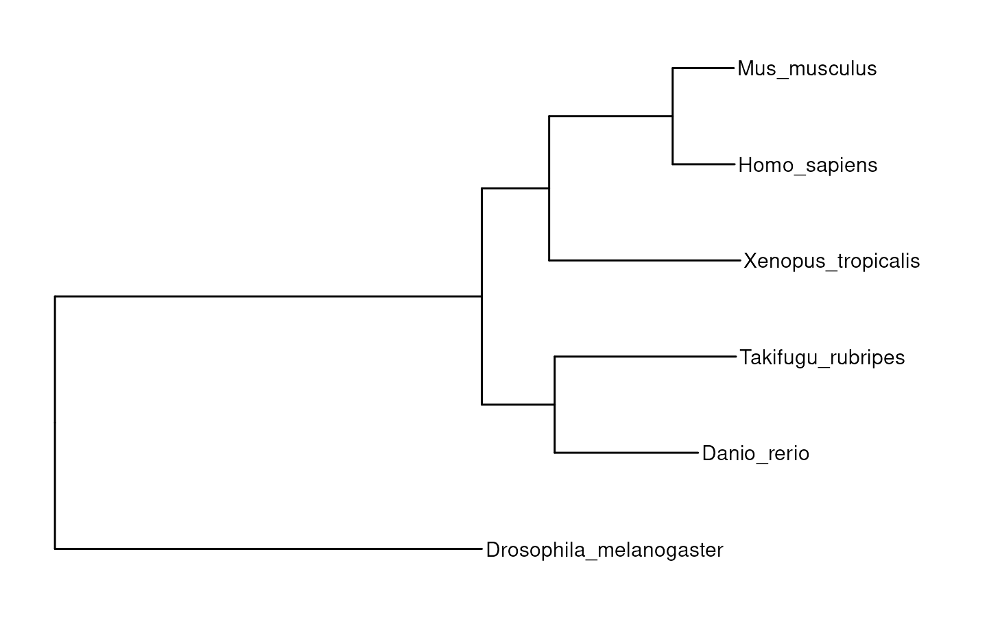
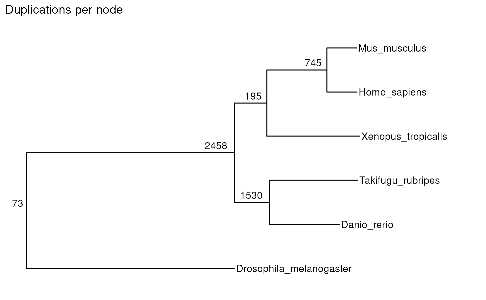
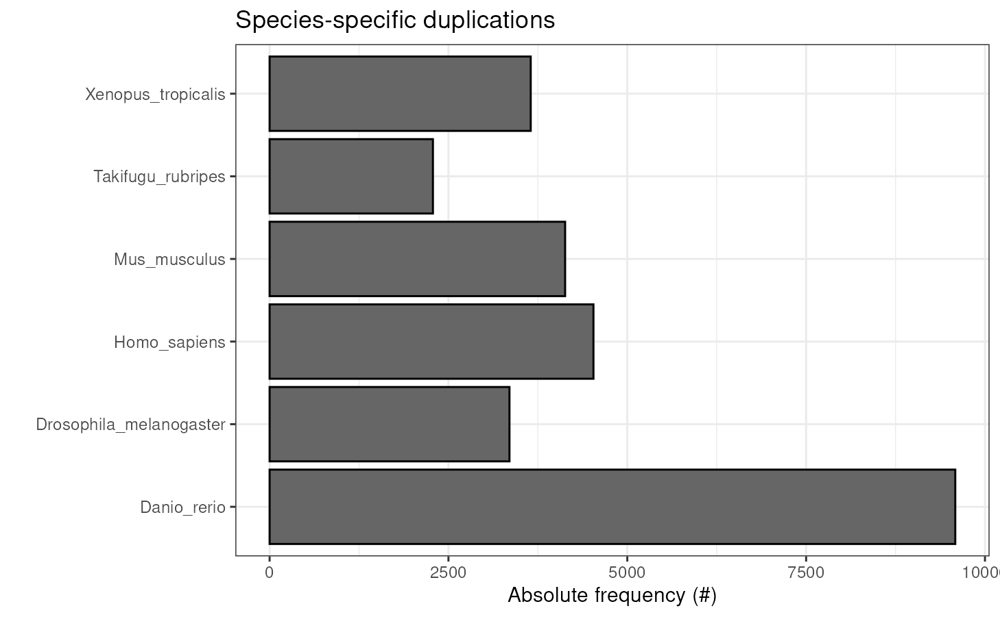
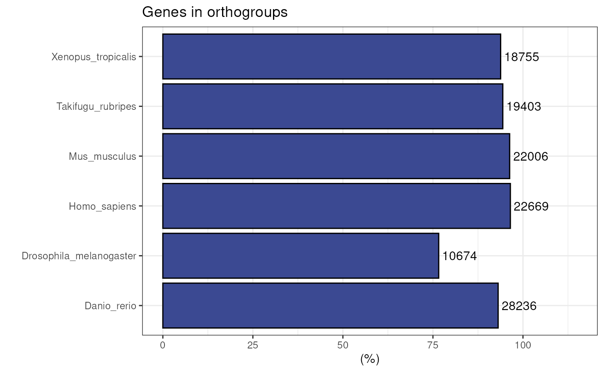
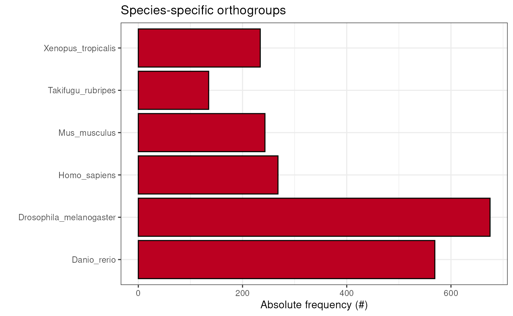
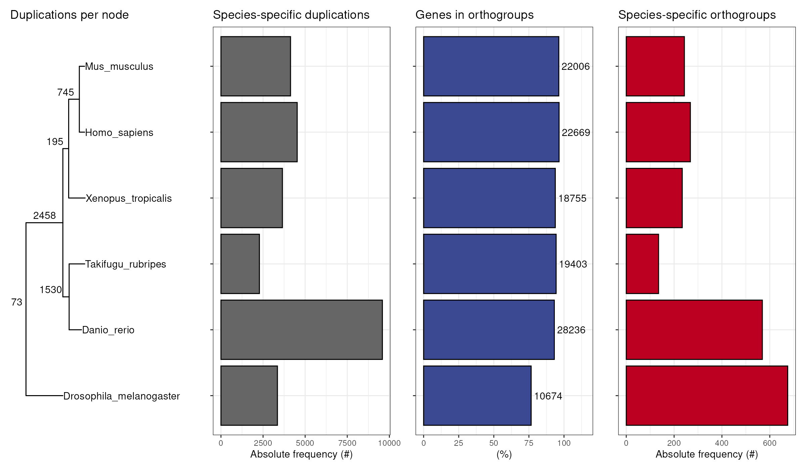
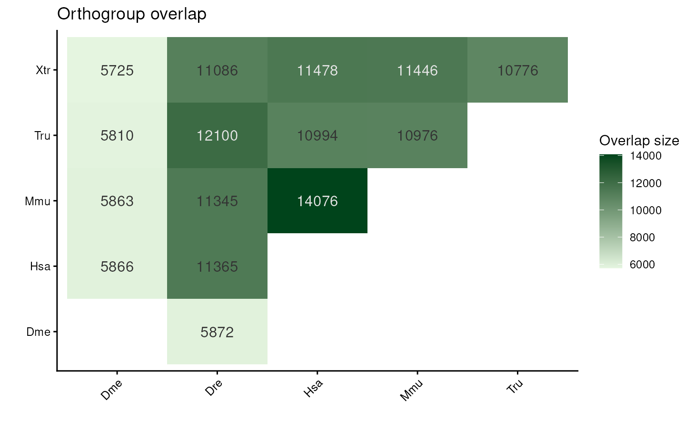
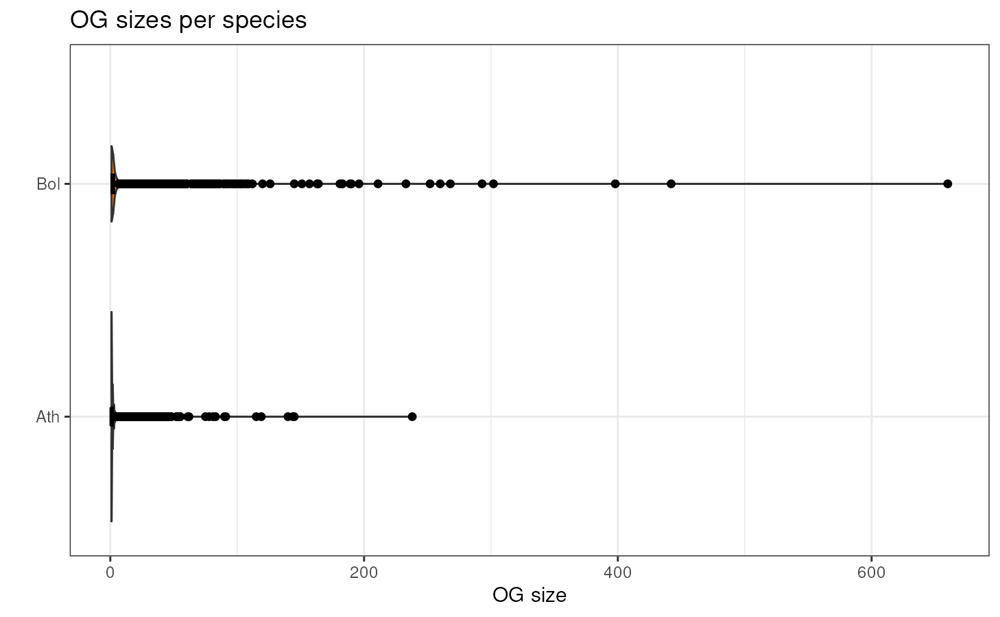
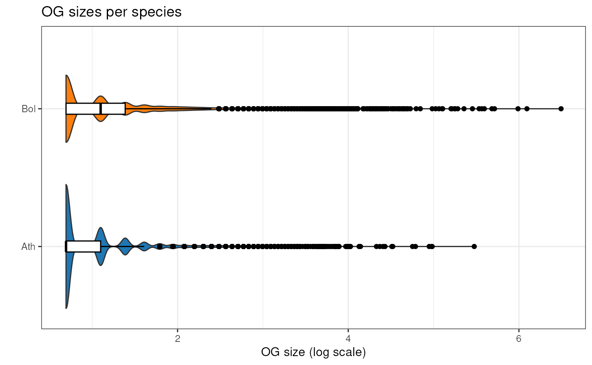
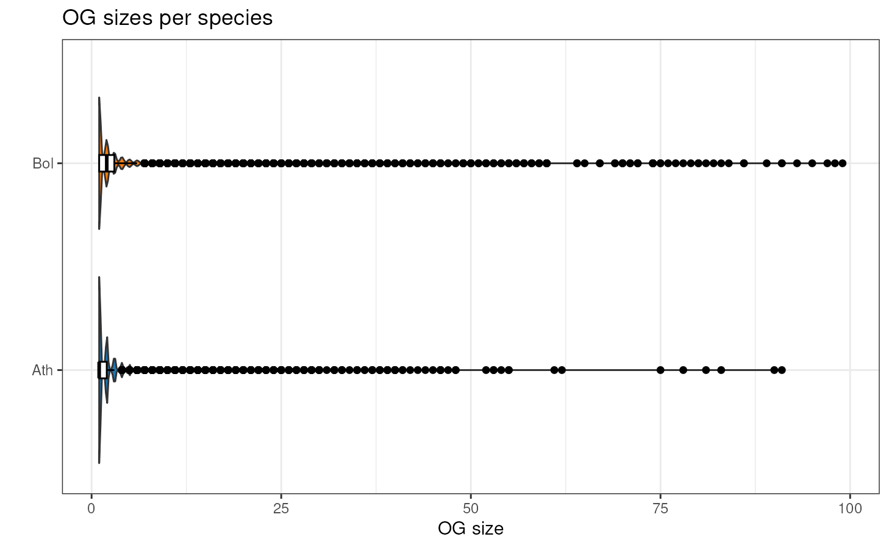

# Assessing orthogroup inference

## Introduction

The identification of groups of homologous genes within and across
species is a powerful tool for evolutionary genomics. The most widely
used tools to identify orthogroups (i.e., groups of orthologous genes)
are OrthoFinder (Emms and Kelly 2019) and OrthoMCL (Li et al. 2003).
However, these tools generate different results depending on the
parameters used, such as *mcl inflation parameter*, *E-value*, *maximum
number of hits*, and others. Here, we propose a protein domain-aware
assessment of orthogroup inference. The goal is to maximize the
percentage of shared protein domains for genes in the same orthogroup.

## Installation

``` r

if(!requireNamespace('BiocManager', quietly = TRUE))
  install.packages('BiocManager')
BiocManager::install("cogeqc")
```

``` r

# Load package after installation
library(cogeqc)
```

## Data description

Here, we will use orthogroups from the PLAZA 5.0 database (Van Bel et
al. 2021), inferred with OrthoFinder (Emms and Kelly 2019). For the
purpose of demonstration, the complete dataset was filtered to only keep
orthogroups for the Brassicaceae species *Arabidopsis thaliana* and
*Brassica oleraceae*. Interpro domain annotations were also retrieved
from PLAZA 5.0.

``` r

# Orthogroups for Arabidopsis thaliana and Brassica oleraceae
data(og)
head(og)
#>     Orthogroup Species      Gene
#> 1 HOM05D000001     Ath AT1G02310
#> 2 HOM05D000001     Ath AT1G03510
#> 3 HOM05D000001     Ath AT1G03540
#> 4 HOM05D000001     Ath AT1G04020
#> 5 HOM05D000001     Ath AT1G04840
#> 6 HOM05D000001     Ath AT1G05750

# Interpro domain annotations
data(interpro_ath)
data(interpro_bol)

head(interpro_ath)
#>        Gene Annotation
#> 1 AT1G01010  IPR036093
#> 2 AT1G01010  IPR003441
#> 3 AT1G01010  IPR036093
#> 4 AT1G01020  IPR007290
#> 5 AT1G01020  IPR007290
#> 6 AT1G01030  IPR003340
head(interpro_bol)
#>           Gene Annotation
#> 1 BolC1t00001H  IPR014710
#> 2 BolC1t00001H  IPR018490
#> 3 BolC1t00002H  IPR013057
#> 4 BolC1t00003H  IPR013057
#> 5 BolC1t00004H  IPR005178
#> 6 BolC1t00004H  IPR005178
```

If you infer orthogroups with OrthoFinder, you can read and parse the
output file **Orthogroups.tsv** with the function
[`read_orthogroups()`](../reference/read_orthogroups.md). For example:

``` r

# Path to the Orthogroups.tsv file created by OrthoFinder
og_file <- system.file("extdata", "Orthogroups.tsv.gz", package = "cogeqc") 

# Read and parse file
orthogroups <- read_orthogroups(og_file)
head(orthogroups)
#>     Orthogroup Species      Gene
#> 1 HOM05D000001     Ath AT1G02310
#> 2 HOM05D000001     Ath AT1G03510
#> 3 HOM05D000001     Ath AT1G03540
#> 4 HOM05D000001     Ath AT1G04020
#> 5 HOM05D000001     Ath AT1G04840
#> 6 HOM05D000001     Ath AT1G05750
```

## Assessing orthogroups

In `cogeqc`, you can assess orthogroup inference with either a protein
domain-based approach or a reference-based approach. Both approaches are
described below.

### Protein domain-based orthogroup assessment

The protein domain-based assessment of orthogroups is based on the
formula below:

``` math
\begin{aligned}
Scores &= Homogeneity - Dispersal
\\
\end{aligned}
```

The $`homogeneity`$ term is the mean Sorensen-Dice index for all
pairwise combinations of genes in an orthogroup. The Sorensen-Dice index
measures how similar two genes are, and it ranges from 0 to 1, with 0
meaning that a gene pair does not share any protein domain, and 1
meaning that it shares all protein domains. In a formal definition:

``` math
\begin{aligned}
Homogeneity &=  \frac{1}{N_{pairs}} \sum_{i=1}^{N_{pairs}} SDI_{i}
\\
\\
SDI(A,B) &= \frac{2 \left| A \cap B \right|}{ \left|A \right| + \left| B \right|}
\end{aligned}
```

where A and B are the set of protein domains associated to genes A and
B. This way, if all genes in an orthogroup have the same protein
domains, it will have $`homogeneity = 1`$. If each gene has a different
protein domain, the orthogroup will have $`homogeneity = 0`$. If only
some gene pairs share the same domain, $`homogeneity`$ will be somewhere
between 0 and 1.

The $`dispersal`$ term aims to correct for overclustering (i.e.,
orthogroup assignments that break “true” gene families into an
artificially large number of smaller subfamilies), and it is the
relative frequency of dispersed domains (i.e., domains that are split
into multiple orthogroups). This term penalizes orthogroup assignments
where the same protein domains appears in multiple orthogroups. As
orthogroups represent groups of genes that evolved from a common
ancestor, a protein domain being present in multiple orthogroups
indicates that this domain evolved multiple times in an independent way,
which is not reasonable from a phylogenetic point of view, despite
convergent evolution.

To calculate scores for each orthogroup, you can use the function
[`assess_orthogroups()`](../reference/assess_orthogroups.md). This
function takes as input a list of annotation data frames[^1] and an
orthogroups data frame, and returns the relative homogeneity scores of
each orthogroup for each species. If you do not want to calculate scores
separately by species, you can also use the function
[`calculate_H()`](../reference/calculate_H.md). Note that if you don’t
want to take the dispersal into account, you can set
`correct_overclustering = FALSE`.

``` r

# Create a list of annotation data frames
annotation <- list(Ath = interpro_ath, Bol = interpro_bol)
str(annotation) # This is what the list must look like
#> List of 2
#>  $ Ath:'data.frame': 131661 obs. of  2 variables:
#>   ..$ Gene      : chr [1:131661] "AT1G01010" "AT1G01010" "AT1G01010" "AT1G01020" ...
#>   ..$ Annotation: chr [1:131661] "IPR036093" "IPR003441" "IPR036093" "IPR007290" ...
#>  $ Bol:'data.frame': 212665 obs. of  2 variables:
#>   ..$ Gene      : chr [1:212665] "BolC1t00001H" "BolC1t00001H" "BolC1t00002H" "BolC1t00003H" ...
#>   ..$ Annotation: chr [1:212665] "IPR014710" "IPR018490" "IPR013057" "IPR013057" ...

og_assessment <- assess_orthogroups(og, annotation)
head(og_assessment)
#>    Orthogroups    Ath_score Bol_score Mean_score Median_score
#> 1 HOM05D000002  0.143273487 0.5167253  0.3299994    0.3299994
#> 2 HOM05D000003  1.006908255        NA  1.0069083    1.0069083
#> 3 HOM05D000004 -0.004569929 0.9585372  0.4769836    0.4769836
#> 4 HOM05D000005  1.287616656        NA  1.2876167    1.2876167
#> 5 HOM05D000006  3.204434463 0.9160169  2.0602257    2.0602257
#> 6 HOM05D000007  1.616741337 1.3038395  1.4602904    1.4602904
```

Now, we can calculate the mean score for this orthogroup inference.

``` r

mean(og_assessment$Mean_score)
#> [1] 1.797598
```

Ideally, to have a reliable orthogroup inference, you should be able to
run OrthoFinder with multiple combinations of parameters and assess each
inference with
[`assess_orthogroups()`](../reference/assess_orthogroups.md). The
inference with the highest mean homonegeneity will be the best.[^2]

### Reference-based orthogroup assessment

In some cases, you may want to compare your orthogroup inference to a
reference orthogroup inference. To do that, you can use the function
[`compare_orthogroups()`](../reference/compare_orthogroups.md). For
example, let’s simulate a different orthogroup inference by shuffling
some rows of the `og` data frame and compare it to the original data
frame.

``` r

set.seed(123)

# Subset the top 5000 rows for demonstration purposes
og_subset <- og[1:5000, ]
ref <- og_subset

# Shuffle 100 genes to simulate a test set
idx_shuffle <- sample(seq_len(nrow(og_subset)), 100, replace = FALSE)
test <- og_subset
test$Gene[idx_shuffle] <- sample(
  test$Gene[idx_shuffle], size = length(idx_shuffle), replace = FALSE
)

# Compare test set to reference set
comparison <- compare_orthogroups(ref, test)
head(comparison)
#>     Orthogroup Preserved
#> 1 HOM05D000001     FALSE
#> 2 HOM05D000002     FALSE
#> 3 HOM05D000003     FALSE
#> 4 HOM05D000004      TRUE
#> 5 HOM05D000005     FALSE
#> 6 HOM05D000006      TRUE

# Calculating percentage of preservation
preserved <- sum(comparison$Preserved) / length(comparison$Preserved)
preserved
#> [1] 0.2702703
```

As we can see, 27.03% of the orthogroups in the reference data set are
preserved in the shuffled data set.

## Visualizing summary statistics

Now that you have identified the best combination of parameters for your
orthogroup inference, you can visually explore some of its summary
statistics. OrthoFinder automatically saves summary statistics in a
directory named **Comparative_Genomics_Statistics**. You can parse this
directory in a list of summary statistics with the function
[`read_orthofinder_stats()`](../reference/read_orthofinder_stats.md). To
demonstrate it, let’s read the output of OrthoFinder’s example with
model species.

``` r

stats_dir <- system.file("extdata", package = "cogeqc")
ortho_stats <- read_orthofinder_stats(stats_dir)
ortho_stats
#> $stats
#>                   Species N_genes N_genes_in_OGs Perc_genes_in_OGs N_ssOGs
#> 1             Danio_rerio   30313          28236              93.1     569
#> 2 Drosophila_melanogaster   13931          10674              76.6     675
#> 3            Homo_sapiens   23480          22669              96.5     268
#> 4            Mus_musculus   22859          22006              96.3     243
#> 5       Takifugu_rubripes   20545          19403              94.4     135
#> 6      Xenopus_tropicalis   19987          18755              93.8     234
#>   N_genes_in_ssOGs Perc_genes_in_ssOGs Dups
#> 1             3216                10.6 9585
#> 2             3313                23.8 3353
#> 3             1625                 6.9 4527
#> 4             2022                 8.8 4131
#> 5              446                 2.2 2283
#> 6             1580                 7.9 3650
#> 
#> $duplications
#>                       Node Duplications_50
#> 1  Drosophila_melanogaster            3353
#> 2             Homo_sapiens            4527
#> 3                       N0              73
#> 4        Takifugu_rubripes            2283
#> 5             Mus_musculus            4131
#> 6              Danio_rerio            9585
#> 7                       N1            2458
#> 8                       N2            1530
#> 9                       N3             195
#> 10                      N4             745
#> 11      Xenopus_tropicalis            3650
```

Now, we can use this list to visually explore summary statistics.

### Species tree

To start, one would usually want to look at the species tree to detect
possible issues that would compromise the accuracy of orthologs
detection. The tree file can be easily read with
[`treeio::read.tree()`](https://rdrr.io/pkg/ape/man/read.tree.html).

``` r

data(tree)
plot_species_tree(tree)
```



You can also include the number of gene duplications in each node.

``` r

plot_species_tree(tree, stats_list = ortho_stats)
#> ! # Invaild edge matrix for <phylo>. A <tbl_df> is returned.
#> ! # Invaild edge matrix for <phylo>. A <tbl_df> is returned.
```



### Species-specific duplications

The species tree above shows duplications per node, but it does not show
species-duplications. To visualize that, you can use the function
[`plot_duplications()`](../reference/plot_duplications.md).

``` r

plot_duplications(ortho_stats)
```



### Genes in orthogroups

Visualizing the percentage of genes in orthogroups is particularly
useful for quality check, since one would usually expect a large
percentage of genes in orthogroups, unless there is a very distant
species in OrthoFinder’s input proteome data.

``` r

plot_genes_in_ogs(ortho_stats)
```



### Species-specific orthogroups

To visualize the number of species-specific orthogroups, use the
function
[`plot_species_specific_ogs()`](../reference/plot_species_specific_ogs.md).
This plot can reveal a unique gene repertoire of a particular species if
it has a large number of species-specific OGs as compared to the other
ones.

``` r

plot_species_specific_ogs(ortho_stats)
```



### All in one

To get a complete picture of OrthoFinder results, you can combine all
plots together with
[`plot_orthofinder_stats()`](../reference/plot_orthofinder_stats.md), a
wrapper that integrates all previously demonstrated plotting functions.

``` r

plot_orthofinder_stats(
  tree, 
  xlim = c(-0.1, 2),
  stats_list = ortho_stats
)
#> ! # Invaild edge matrix for <phylo>. A <tbl_df> is returned.
#> ! # Invaild edge matrix for <phylo>. A <tbl_df> is returned.
```



### Orthogroup overlap

You can also visualize a heatmap of pairwise orthogroup overlap (i.e.,
number of shared orthogroups) for each species pair with
[`plot_og_overlap()`](../reference/plot_og_overlap.md). Previous
versions of OrthoFinder used to return such data in a square matrix
saved to
`Comparative_Genomics_Statistics/Orthogroups_SpeciesOverlaps.tsv`.
However, since OrthoFinder v3, this file is no longer created. Hence,
you will first need to compute pairwise orthogroup overlaps from the
orthogroups table created with
[`read_orthogroups()`](../reference/read_orthogroups.md).

To demonstrate how this works, let’s compute pairwise orthogroup
overlaps using the example object `og`.

``` r

og_overlap <- get_og_overlap(og)
og_overlap
#>   sp1 sp2 og_overlap
#> 1 Ath Bol       8113
```

In this case, since the example object `og` contains only 2 species,
[`get_og_overlap()`](../reference/get_og_overlap.md) returns only one
comparison. The more species you have, the more comparisons you’d get.
As a demonstration of a nicer-looking table, the example object
`og_overlap_model` contains the output of
[`get_og_overlap()`](../reference/get_og_overlap.md) run on the output
of OrthoFinder with model organisms (see examples in OrthoFinder docs
for details).

``` r

# Load example overlap table for model organisms and have a look at it
data(og_overlap_model)
head(og_overlap_model)
#>                       sp1                     sp2 og_overlap
#> 1             Danio_rerio Drosophila_melanogaster       5872
#> 2             Danio_rerio            Homo_sapiens      11365
#> 3             Danio_rerio            Mus_musculus      11345
#> 4             Danio_rerio       Takifugu_rubripes      12100
#> 5             Danio_rerio      Xenopus_tropicalis      11086
#> 6 Drosophila_melanogaster            Homo_sapiens       5866

# Plot overlaps
plot_og_overlap(og_overlap_model, add_numbers = TRUE)
```



### Orthogroup size per species

If you want to take a look at the distribution of OG sizes for each
species, you can use the function `plot_og_sizes`. If you have many
extreme values and want to visualize the shape of the distribution in a
better way, you can log transform the OG sizes (with `log = TRUE`)
and/or remove OG larger than a particular threshold (with
`max_size = 100`, for example).

``` r

plot_og_sizes(og) 
```



``` r

plot_og_sizes(og, log = TRUE) # natural logarithm scale
```



``` r

plot_og_sizes(og, max_size = 100) # only OGs with <= 100 genes
```



## Session information

This document was created under the following conditions:

``` r

sessioninfo::session_info()
#> ─ Session info ───────────────────────────────────────────────────────────────
#>  setting  value
#>  version  R Under development (unstable) (2026-03-01 r89508)
#>  os       Ubuntu 24.04.4 LTS
#>  system   x86_64, linux-gnu
#>  ui       X11
#>  language en
#>  collate  en_US.UTF-8
#>  ctype    en_US.UTF-8
#>  tz       UTC
#>  date     2026-03-05
#>  pandoc   3.9 @ /usr/bin/ (via rmarkdown)
#>  quarto   1.8.27 @ /usr/local/bin/quarto
#> 
#> ─ Packages ───────────────────────────────────────────────────────────────────
#>  package           * version date (UTC) lib source
#>  ape                 5.8-1   2024-12-16 [1] CRAN (R 4.6.0)
#>  aplot               0.2.9   2025-09-12 [1] CRAN (R 4.6.0)
#>  beeswarm            0.4.0   2021-06-01 [1] CRAN (R 4.6.0)
#>  BiocGenerics        0.57.0  2025-10-30 [1] Bioconductor 3.23 (R 4.6.0)
#>  BiocManager         1.30.27 2025-11-14 [1] CRAN (R 4.6.0)
#>  BiocStyle         * 2.39.0  2025-10-30 [1] Bioconductor 3.23 (R 4.6.0)
#>  Biostrings          2.79.4  2026-01-07 [1] Bioconductor 3.23 (R 4.6.0)
#>  bookdown            0.46    2025-12-05 [1] CRAN (R 4.6.0)
#>  bslib               0.10.0  2026-01-26 [2] CRAN (R 4.6.0)
#>  cachem              1.1.0   2024-05-16 [2] CRAN (R 4.6.0)
#>  cli                 3.6.5   2025-04-23 [2] CRAN (R 4.6.0)
#>  cogeqc            * 1.15.1  2026-03-05 [1] Bioconductor
#>  crayon              1.5.3   2024-06-20 [2] CRAN (R 4.6.0)
#>  desc                1.4.3   2023-12-10 [2] CRAN (R 4.6.0)
#>  digest              0.6.39  2025-11-19 [2] CRAN (R 4.6.0)
#>  dplyr               1.2.0   2026-02-03 [1] CRAN (R 4.6.0)
#>  evaluate            1.0.5   2025-08-27 [2] CRAN (R 4.6.0)
#>  farver              2.1.2   2024-05-13 [1] CRAN (R 4.6.0)
#>  fastmap             1.2.0   2024-05-15 [2] CRAN (R 4.6.0)
#>  fontBitstreamVera   0.1.1   2017-02-01 [1] CRAN (R 4.6.0)
#>  fontLiberation      0.1.0   2016-10-15 [1] CRAN (R 4.6.0)
#>  fontquiver          0.2.1   2017-02-01 [1] CRAN (R 4.6.0)
#>  fs                  1.6.6   2025-04-12 [2] CRAN (R 4.6.0)
#>  gdtools             0.5.0   2026-02-09 [1] CRAN (R 4.6.0)
#>  generics            0.1.4   2025-05-09 [1] CRAN (R 4.6.0)
#>  ggbeeswarm          0.7.3   2025-11-29 [1] CRAN (R 4.6.0)
#>  ggfun               0.2.0   2025-07-15 [1] CRAN (R 4.6.0)
#>  ggiraph             0.9.6   2026-02-21 [1] CRAN (R 4.6.0)
#>  ggplot2             4.0.2   2026-02-03 [1] CRAN (R 4.6.0)
#>  ggplotify           0.1.3   2025-09-20 [1] CRAN (R 4.6.0)
#>  ggtree              4.1.1   2025-10-30 [1] Bioconductor 3.23 (R 4.6.0)
#>  glue                1.8.0   2024-09-30 [2] CRAN (R 4.6.0)
#>  gridGraphics        0.5-1   2020-12-13 [1] CRAN (R 4.6.0)
#>  gtable              0.3.6   2024-10-25 [1] CRAN (R 4.6.0)
#>  htmltools           0.5.9   2025-12-04 [2] CRAN (R 4.6.0)
#>  htmlwidgets         1.6.4   2023-12-06 [2] CRAN (R 4.6.0)
#>  igraph              2.2.2   2026-02-12 [1] CRAN (R 4.6.0)
#>  IRanges             2.45.0  2025-10-31 [1] Bioconductor 3.23 (R 4.6.0)
#>  jquerylib           0.1.4   2021-04-26 [2] CRAN (R 4.6.0)
#>  jsonlite            2.0.0   2025-03-27 [2] CRAN (R 4.6.0)
#>  knitr               1.51    2025-12-20 [2] CRAN (R 4.6.0)
#>  labeling            0.4.3   2023-08-29 [1] CRAN (R 4.6.0)
#>  lattice             0.22-9  2026-02-09 [3] CRAN (R 4.6.0)
#>  lazyeval            0.2.2   2019-03-15 [1] CRAN (R 4.6.0)
#>  lifecycle           1.0.5   2026-01-08 [2] CRAN (R 4.6.0)
#>  magrittr            2.0.4   2025-09-12 [2] CRAN (R 4.6.0)
#>  MASS                7.3-65  2025-02-28 [3] CRAN (R 4.6.0)
#>  nlme                3.1-168 2025-03-31 [3] CRAN (R 4.6.0)
#>  otel                0.2.0   2025-08-29 [2] CRAN (R 4.6.0)
#>  patchwork           1.3.2   2025-08-25 [1] CRAN (R 4.6.0)
#>  pillar              1.11.1  2025-09-17 [2] CRAN (R 4.6.0)
#>  pkgconfig           2.0.3   2019-09-22 [2] CRAN (R 4.6.0)
#>  pkgdown             2.2.0   2025-11-06 [1] CRAN (R 4.6.0)
#>  plyr                1.8.9   2023-10-02 [1] CRAN (R 4.6.0)
#>  purrr               1.2.1   2026-01-09 [2] CRAN (R 4.6.0)
#>  R6                  2.6.1   2025-02-15 [2] CRAN (R 4.6.0)
#>  ragg                1.5.0   2025-09-02 [2] CRAN (R 4.6.0)
#>  rappdirs            0.3.4   2026-01-17 [2] CRAN (R 4.6.0)
#>  RColorBrewer        1.1-3   2022-04-03 [1] CRAN (R 4.6.0)
#>  Rcpp                1.1.1   2026-01-10 [2] CRAN (R 4.6.0)
#>  reshape2            1.4.5   2025-11-12 [1] CRAN (R 4.6.0)
#>  rlang               1.1.7   2026-01-09 [2] CRAN (R 4.6.0)
#>  rmarkdown           2.30    2025-09-28 [1] CRAN (R 4.6.0)
#>  S4Vectors           0.49.0  2025-10-30 [1] Bioconductor 3.23 (R 4.6.0)
#>  S7                  0.2.1   2025-11-14 [1] CRAN (R 4.6.0)
#>  sass                0.4.10  2025-04-11 [2] CRAN (R 4.6.0)
#>  scales              1.4.0   2025-04-24 [1] CRAN (R 4.6.0)
#>  Seqinfo             1.1.0   2025-10-31 [1] Bioconductor 3.23 (R 4.6.0)
#>  sessioninfo         1.2.3   2025-02-05 [2] CRAN (R 4.6.0)
#>  stringi             1.8.7   2025-03-27 [2] CRAN (R 4.6.0)
#>  stringr             1.6.0   2025-11-04 [2] CRAN (R 4.6.0)
#>  systemfonts         1.3.1   2025-10-01 [2] CRAN (R 4.6.0)
#>  textshaping         1.0.4   2025-10-10 [2] CRAN (R 4.6.0)
#>  tibble              3.3.1   2026-01-11 [2] CRAN (R 4.6.0)
#>  tidyr               1.3.2   2025-12-19 [1] CRAN (R 4.6.0)
#>  tidyselect          1.2.1   2024-03-11 [1] CRAN (R 4.6.0)
#>  tidytree            0.4.7   2026-01-08 [1] CRAN (R 4.6.0)
#>  treeio              1.35.0  2025-10-30 [1] Bioconductor 3.23 (R 4.6.0)
#>  vctrs               0.7.1   2026-01-23 [2] CRAN (R 4.6.0)
#>  vipor               0.4.7   2023-12-18 [1] CRAN (R 4.6.0)
#>  withr               3.0.2   2024-10-28 [2] CRAN (R 4.6.0)
#>  xfun                0.56    2026-01-18 [2] CRAN (R 4.6.0)
#>  XVector             0.51.0  2025-10-31 [1] Bioconductor 3.23 (R 4.6.0)
#>  yaml                2.3.12  2025-12-10 [2] CRAN (R 4.6.0)
#>  yulab.utils         0.2.4   2026-02-02 [1] CRAN (R 4.6.0)
#> 
#>  [1] /__w/_temp/Library
#>  [2] /usr/local/lib/R/site-library
#>  [3] /usr/local/lib/R/library
#>  * ── Packages attached to the search path.
#> 
#> ──────────────────────────────────────────────────────────────────────────────
```

## References

Emms, David M, and Steven Kelly. 2019. “OrthoFinder: Phylogenetic
Orthology Inference for Comparative Genomics.” *Genome Biology* 20 (1):
1–14.

Li, Li, Christian J Stoeckert, and David S Roos. 2003. “OrthoMCL:
Identification of Ortholog Groups for Eukaryotic Genomes.” *Genome
Research* 13 (9): 2178–89.

Van Bel, Michiel, Francesca Silvestri, Eric M Weitz, et al. 2021. “PLAZA
5.0: Extending the Scope and Power of Comparative and Functional
Genomics in Plants.” *Nucleic Acids Research*.

[^1]: **NOTE:** The names of the list elements must match the species
    abbreviations in the column *Species* of the orthogroups data frame.
    For instance, if your orthogroups data frame contains the species
    **Ath** and **Bol**, the data frames in the annotation list must be
    named **Ath** and **Bol** (not necessarily in that order, but with
    these exact names).

[^2]: **Friendly tip:** if you want to calculate homogeneity scores
    using a single species as a proxy (your orthogroups data frame will
    have only one species), you can use the function
    [`calculate_H()`](../reference/calculate_H.md).
